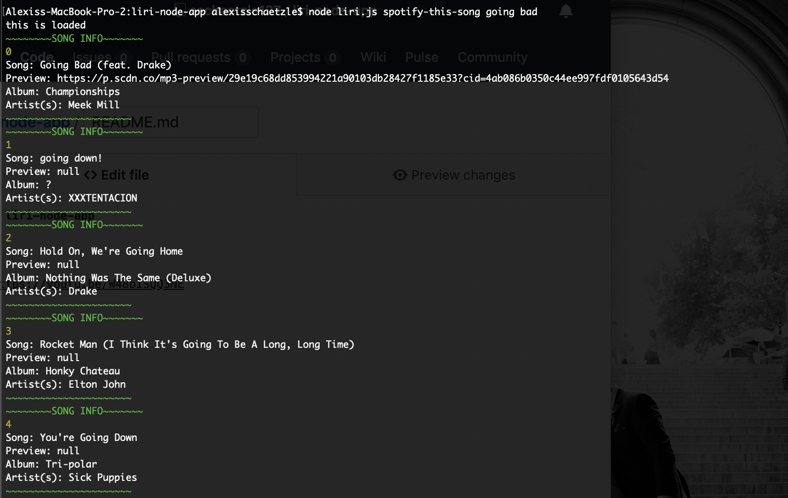
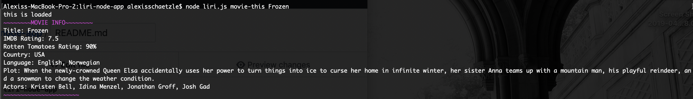

# liri-node-app

This liri node application intake's four user input commands and returns API JSON information in order to fulfill said commands.  

The commands are as follows: 

concert-this
    - this command allows the user to see the artist of choice's upcoming shows using the Bands In Town API.  
    - The user inputs "concert-this" followed by the artist or band name they would like to search.

spotify-this-song
    - this command allows the user to search for any song by title that they choose. 
    - The user inputs "spotify-this-song" followed by the title of the sond they would like to search.

movie-this
    -This command allows the user to search for any movie by the title of movie and returns basic IMDB information available including ratings from IMDB and Rotten Tomatoes
    - The user inputs "movie-this" followed by the title of the movie they would like to search.  Any movie title longer than one word should have a "-" between the word instead of a space.  Ex: The Shawshank Redemption = the-shawshank-redemption
    
    
do-what-it-says
    -This command takes a previously defined search term from another document and populates the corresponding Spotify response
    

Please see the video below for an example of a full run through of the application:

https://youtu.be/W48bISQQ3NE
